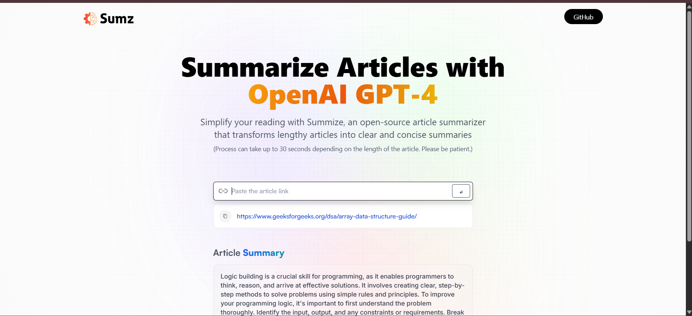
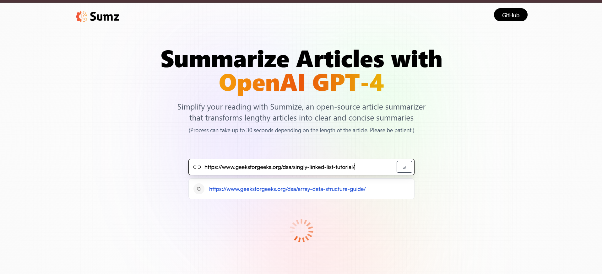
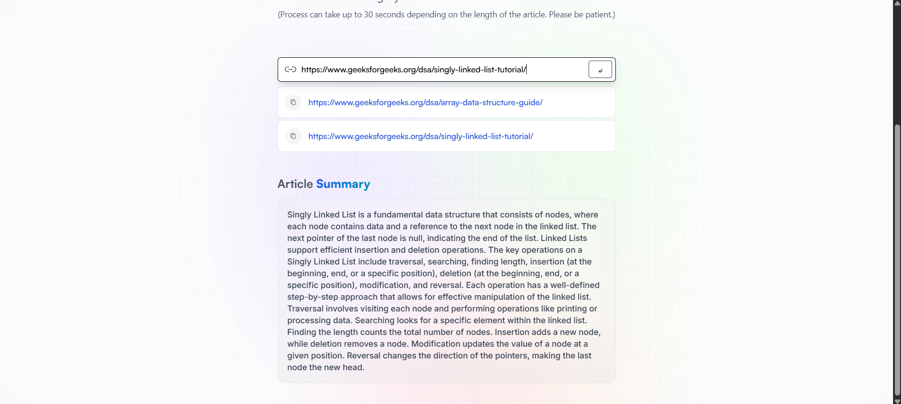

# AI-Powered Text Summarizer with ReactJS

## Project Goal

The primary aim of this `reactjs-ai-summarizer` initiative is to offer users a smooth and intuitive platform to utilize artificial intelligence for text summarization. Inspired by a specific YouTube guide, the objective is to elevate the user experience by enabling swift creation of concise summaries from extensive articles or documents.

## Overview

The `reactjs-ai-summarizer` is a web application built with ReactJS, integrating advanced AI capabilities for efficient text summarization. Users can effortlessly input their content, and the application's sophisticated algorithms will process it to produce coherent and condensed summaries. This project combines the strengths of ReactJS, Redux Toolkit, and Tailwind CSS to construct an aesthetically pleasing and highly responsive user interface.

## Live Application

Access and interact with my project [here](https://reactjs-ai-summarizer.vercel.app/) 👈

## Project Structure

```
reactjs-ai-summarizer  (folder)
|----readme.md
SOLUTION
├── public
│    └── index.html
├── src
│    ├── services
│    │       └── article.jsx
│    │       └── store.js
│    ├── assets
│    │       └── [images]
│    ├── components
│    │       ├── Demo.jsx
│    │       └── Hero.jsx
│    ├── App.css
│    ├── App.jsx
│    └── main.jsx
├── .env
├── .gitignore
├── .eslintrc.cjs
├── index.html
├── package-lock.json
├── package.json
├── postcss.config.js
├── tailwind.config.js
└── vite.config.js
```

### Core Concepts Explored in this Project

Upon completion, this project demonstrates proficiency in the following areas:

  * HTML
  * CSS
  * JavaScript
  * ReactJS
  * Redux Toolkit
  * Tailwind CSS
  * RapidAPI

### Local Setup Guide

To get this project running on your local machine, follow these steps:

```bash
# Obtain the project's source code
$ git clone "repository-link"

# Navigate into the project directory
$ cd ./reactjs-ai-summarizer

# Create an environment configuration file in the project root
$ touch .env

# Open the .env file in your preferred text editor and add this line:
# Ensure you replace 'your_rapid_api_key' with the actual key retrieved from https://rapidapi.com/restyler/api/article-extractor-and-summarizer
VITE_RAPID_API_ARTICLE_KEY=your_rapid_api_key

# Save the .env file and close it

# Install the project dependencies using Vite (choose npm or yarn)
$ npm install vite / yarn install vite

# Launch the development server with Vite
$ npm run dev / yarn dev
```

### Visuals






